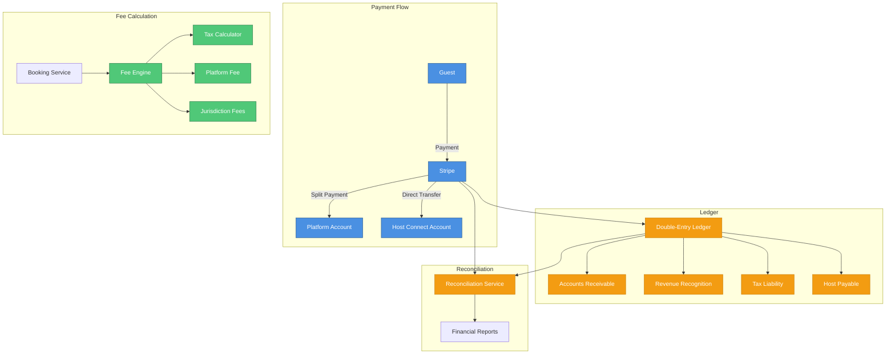

# Payments Architecture

## Purpose

This document defines the payments and financial ledger architecture for the Prep platform, including Stripe Connect integration, fee calculation, tax remittance, and GAAP-compliant accounting.

---

## Architecture Overview



---

## Stripe Connect Architecture

### Account Structure

**Platform Account** (`acct_prep_platform`)
- Master Stripe account
- Collects platform fees
- Handles tax remittance
- Manages disputes and refunds

**Host Connect Accounts** (`acct_*`)
- One per vendor/operator
- Standard Connect accounts (not Express)
- Hosts control payout schedule
- Platform can create charges and transfers

### Payment Flow

1. **Guest books property** → Booking created in `pending_payment` state
2. **Payment intent created** → `PaymentIntent` with automatic payment methods
3. **Charge authorization** → Funds authorized on guest's card
4. **Compliance check** → RegEngine validates booking
5. **Charge capture** → Funds captured if compliant
6. **Fee calculation** → Platform fees, taxes, host payout calculated
7. **Transfer creation** → Funds transferred to host Connect account
8. **Ledger entries** → Double-entry bookkeeping records created

### Stripe Connect Implementation

```python
import stripe

stripe.api_key = settings.STRIPE_SECRET_KEY

# Create Connect account for new vendor
def create_connect_account(vendor_id: str, business_info: dict):
    account = stripe.Account.create(
        type="standard",
        country="US",
        email=business_info["email"],
        business_type=business_info["business_type"],
        metadata={"vendor_id": vendor_id},
    )
    return account.id

# Create payment with application fee
def create_payment_intent(booking: Booking, fee_breakdown: FeeBreakdown):
    intent = stripe.PaymentIntent.create(
        amount=int(fee_breakdown.total * 100),  # Convert to cents
        currency="usd",
        application_fee_amount=int(fee_breakdown.platform_fee * 100),
        transfer_data={
            "destination": booking.vendor.stripe_account_id,
        },
        metadata={
            "booking_id": str(booking.booking_id),
            "vendor_id": str(booking.vendor_id),
            "facility_id": str(booking.facility_id),
        },
        description=f"Booking for {booking.facility.address.city}",
        statement_descriptor="PREP BOOKING",
    )
    return intent

# Handle successful payment webhook
@router.post("/webhooks/stripe")
async def stripe_webhook(request: Request):
    payload = await request.body()
    sig_header = request.headers.get("stripe-signature")

    try:
        event = stripe.Webhook.construct_event(
            payload, sig_header, settings.STRIPE_WEBHOOK_SECRET
        )
    except ValueError:
        raise HTTPException(status_code=400, detail="Invalid payload")
    except stripe.error.SignatureVerificationError:
        raise HTTPException(status_code=400, detail="Invalid signature")

    if event["type"] == "payment_intent.succeeded":
        await handle_payment_succeeded(event["data"]["object"])
    elif event["type"] == "transfer.created":
        await handle_transfer_created(event["data"]["object"])

    return {"status": "success"}
```

---

## Fee Calculation Engine

### Fee Components

Every booking has multiple fee components:

1. **Base Rent**: Nightly rate × number of nights
2. **Cleaning Fee**: One-time cleaning charge
3. **Platform Service Fee**: % of base rent (typically 3-5%)
4. **TOT (Transient Occupancy Tax)**: Jurisdiction-specific % (10-14%)
5. **Sales Tax**: Jurisdiction-specific % (varies)
6. **Local Fees**: Business license fees, registration fees, etc.

### Fee Breakdown Example

```
Booking: 3 nights @ $200/night in San Francisco

Base Rent:               $600.00
Cleaning Fee:            $100.00
Subtotal:                $700.00

Platform Fee (4%):       $ 28.00
SF TOT (14%):            $ 98.00  (14% of $700)
Processing Fee (2.9%):   $ 23.94

Total:                   $849.94

Host Payout:             $648.06  ($700 - $28 - $23.94)
Platform Revenue:        $ 28.00
Tax Remittance:          $ 98.00
Stripe Fees:             $ 23.94
Guest Charge:            $849.94
```

### Fee Calculation Logic

```python
from decimal import Decimal
from pydantic import BaseModel

class FeeBreakdown(BaseModel):
    base_rent: Decimal
    cleaning_fee: Decimal
    subtotal: Decimal
    platform_fee: Decimal
    platform_fee_rate: Decimal
    taxes: list[TaxLine]
    total_taxes: Decimal
    stripe_fee: Decimal
    total: Decimal
    host_payout: Decimal

class TaxLine(BaseModel):
    name: str
    rate: Decimal
    amount: Decimal
    jurisdiction: str
    remittance_account: str

def calculate_fees(
    nightly_rate: Decimal,
    nights: int,
    cleaning_fee: Decimal,
    jurisdiction: str,
) -> FeeBreakdown:
    """Calculate all fees for a booking."""

    base_rent = nightly_rate * nights
    subtotal = base_rent + cleaning_fee

    # Platform fee (configurable per jurisdiction)
    platform_fee_rate = get_platform_fee_rate(jurisdiction)
    platform_fee = subtotal * platform_fee_rate

    # Taxes (jurisdiction-specific)
    tax_rules = get_tax_rules(jurisdiction)
    taxes = []
    total_taxes = Decimal("0")

    for rule in tax_rules:
        tax_amount = subtotal * rule.rate
        taxes.append(
            TaxLine(
                name=rule.name,
                rate=rule.rate,
                amount=tax_amount,
                jurisdiction=rule.jurisdiction,
                remittance_account=rule.remittance_account,
            )
        )
        total_taxes += tax_amount

    # Stripe processing fee (2.9% + $0.30)
    stripe_fee = (subtotal + platform_fee + total_taxes) * Decimal("0.029") + Decimal("0.30")

    total = subtotal + platform_fee + total_taxes + stripe_fee
    host_payout = subtotal - platform_fee - stripe_fee

    return FeeBreakdown(
        base_rent=base_rent,
        cleaning_fee=cleaning_fee,
        subtotal=subtotal,
        platform_fee=platform_fee,
        platform_fee_rate=platform_fee_rate,
        taxes=taxes,
        total_taxes=total_taxes,
        stripe_fee=stripe_fee,
        total=total,
        host_payout=host_payout,
    )
```

---

## Double-Entry Ledger

All financial transactions are recorded using double-entry bookkeeping for GAAP compliance.

### Ledger Structure

Every transaction creates **multiple ledger entries** that balance (total debits = total credits).

#### Example: Guest Payment for $849.94 Booking

| Entry | Account | Type | Amount | Description |
|-------|---------|------|--------|-------------|
| 1 | Cash (1000) | Debit | $849.94 | Guest payment received |
| 2 | Revenue (4000) | Credit | $700.00 | Rental revenue |
| 3 | Platform Fee Revenue (4100) | Credit | $28.00 | Platform service fee |
| 4 | Tax Liability (2200) | Credit | $98.00 | TOT collected |
| 5 | Stripe Fees (5100) | Debit | $23.94 | Payment processing fees |
| 6 | Cash (1000) | Credit | $23.94 | Stripe fee deducted |

#### Example: Host Payout of $648.06

| Entry | Account | Type | Amount | Description |
|-------|---------|------|--------|-------------|
| 1 | Host Payable (2100) | Debit | $648.06 | Host payout |
| 2 | Cash (1000) | Credit | $648.06 | Transfer to host |

### Chart of Accounts

```yaml
# Chart of Accounts (COA)
1000:
  name: "Cash"
  type: "asset"
  description: "Stripe account balance"

1100:
  name: "Accounts Receivable"
  type: "asset"
  description: "Outstanding payments from guests"

2100:
  name: "Host Payable"
  type: "liability"
  description: "Amounts owed to hosts"

2200:
  name: "Tax Liability"
  type: "liability"
  description: "TOT and sales tax collected, pending remittance"

4000:
  name: "Rental Revenue"
  type: "revenue"
  description: "Host rental income (pass-through)"

4100:
  name: "Platform Fee Revenue"
  type: "revenue"
  description: "Platform service fees"

5100:
  name: "Stripe Fees"
  type: "expense"
  description: "Payment processing fees"
```

### Ledger Service Implementation

```python
from prep.models import LedgerEntry
from prep.schemas import ledger_entry as ledger_schema

class LedgerService:
    """Service for creating and querying ledger entries."""

    async def record_guest_payment(
        self,
        booking_id: str,
        fee_breakdown: FeeBreakdown,
        payment_intent_id: str,
    ) -> list[LedgerEntry]:
        """Record guest payment as multiple ledger entries."""

        transaction_id = uuid.uuid4()
        entries = []

        # Debit: Cash (guest payment received)
        entries.append(
            await self._create_entry(
                transaction_id=transaction_id,
                account_type="cash",
                account_code="1000",
                entry_type="debit",
                amount=fee_breakdown.total,
                booking_id=booking_id,
                description=f"Guest payment for booking {booking_id}",
                payment_details={"payment_intent_id": payment_intent_id},
            )
        )

        # Credit: Revenue (rental income)
        entries.append(
            await self._create_entry(
                transaction_id=transaction_id,
                account_type="revenue",
                account_code="4000",
                entry_type="credit",
                amount=fee_breakdown.subtotal,
                booking_id=booking_id,
                description="Rental revenue",
            )
        )

        # Credit: Platform fee revenue
        entries.append(
            await self._create_entry(
                transaction_id=transaction_id,
                account_type="platform_fee_revenue",
                account_code="4100",
                entry_type="credit",
                amount=fee_breakdown.platform_fee,
                booking_id=booking_id,
                description="Platform service fee",
            )
        )

        # Credit: Tax liability
        for tax in fee_breakdown.taxes:
            entries.append(
                await self._create_entry(
                    transaction_id=transaction_id,
                    account_type="tax_liability",
                    account_code="2200",
                    entry_type="credit",
                    amount=tax.amount,
                    booking_id=booking_id,
                    description=f"{tax.name} collected",
                    tax_details={
                        "tax_type": tax.name,
                        "tax_rate": float(tax.rate),
                        "jurisdiction": tax.jurisdiction,
                    },
                )
            )

        # Debit: Stripe fees
        entries.append(
            await self._create_entry(
                transaction_id=transaction_id,
                account_type="stripe_fees",
                account_code="5100",
                entry_type="debit",
                amount=fee_breakdown.stripe_fee,
                booking_id=booking_id,
                description="Payment processing fee",
            )
        )

        # Credit: Cash (stripe fee deducted)
        entries.append(
            await self._create_entry(
                transaction_id=transaction_id,
                account_type="cash",
                account_code="1000",
                entry_type="credit",
                amount=fee_breakdown.stripe_fee,
                booking_id=booking_id,
                description="Stripe fee deduction",
            )
        )

        return entries

    async def _create_entry(self, **kwargs) -> LedgerEntry:
        """Create a single ledger entry."""
        entry_data = {
            "entry_id": str(uuid.uuid4()),
            "transaction_date": datetime.now(timezone.utc),
            "posted_date": datetime.now(timezone.utc),
            "currency": "USD",
            "immutable": True,
            "created_at": datetime.now(timezone.utc),
            **kwargs,
        }

        # Validate against schema
        is_valid, error = ledger_schema.validate_ledger_entry(entry_data)
        if not is_valid:
            raise ValueError(f"Invalid ledger entry: {error}")

        # Insert into database
        entry = LedgerEntry(**entry_data)
        await entry.save()

        return entry
```

---

## Tax Remittance

### Tax Collection

Taxes are collected at booking time and held in `Tax Liability` account.

### Remittance Schedule

| Jurisdiction | Frequency | Due Date | Account |
|--------------|-----------|----------|---------|
| San Francisco TOT | Monthly | 15th of following month | SF Treasurer |
| LA County TOT | Quarterly | End of month following quarter | LA County |
| California Sales Tax | Quarterly | End of month following quarter | CDTFA |

### Remittance Process

```python
class TaxRemittanceService:
    """Handle tax remittance to jurisdictions."""

    async def generate_remittance_report(
        self,
        jurisdiction: str,
        start_date: date,
        end_date: date,
    ) -> TaxRemittanceReport:
        """Generate tax report for remittance."""

        # Query all tax liability entries for jurisdiction
        entries = await LedgerEntry.filter(
            account_type="tax_liability",
            tax_details__jurisdiction=jurisdiction,
            transaction_date__gte=start_date,
            transaction_date__lte=end_date,
        ).all()

        total_collected = sum(entry.amount for entry in entries)

        return TaxRemittanceReport(
            jurisdiction=jurisdiction,
            period_start=start_date,
            period_end=end_date,
            total_collected=total_collected,
            booking_count=len(set(e.booking_id for e in entries)),
            entries=entries,
        )

    async def record_remittance(
        self,
        report: TaxRemittanceReport,
        payment_reference: str,
    ):
        """Record tax remittance payment."""

        transaction_id = uuid.uuid4()

        # Debit: Tax Liability (reduce liability)
        await self._create_ledger_entry(
            transaction_id=transaction_id,
            account_type="tax_liability",
            entry_type="debit",
            amount=report.total_collected,
            description=f"Tax remittance to {report.jurisdiction}",
        )

        # Credit: Cash (payment made)
        await self._create_ledger_entry(
            transaction_id=transaction_id,
            account_type="cash",
            entry_type="credit",
            amount=report.total_collected,
            description=f"Tax payment to {report.jurisdiction}",
            memo=f"Reference: {payment_reference}",
        )
```

---

## Financial Reporting

### Key Reports

1. **Revenue Report**: Platform fees, host payouts, taxes collected
2. **Tax Liability Report**: Outstanding tax liabilities by jurisdiction
3. **Reconciliation Report**: Match Stripe transactions to ledger entries
4. **P&L Statement**: Platform revenue vs. expenses
5. **Cash Flow Statement**: Cash in/out by category

### Report Generation

```python
class FinancialReportService:
    async def generate_revenue_report(
        self, start_date: date, end_date: date
    ) -> RevenueReport:
        """Generate revenue report for a period."""

        entries = await LedgerEntry.filter(
            account_type__in=["revenue", "platform_fee_revenue"],
            entry_type="credit",
            transaction_date__gte=start_date,
            transaction_date__lte=end_date,
        ).all()

        return RevenueReport(
            period_start=start_date,
            period_end=end_date,
            total_rental_revenue=sum(
                e.amount for e in entries if e.account_type == "revenue"
            ),
            total_platform_fees=sum(
                e.amount for e in entries if e.account_type == "platform_fee_revenue"
            ),
            booking_count=len(set(e.booking_id for e in entries)),
        )
```

---

## Reconciliation

### Daily Reconciliation

```python
class ReconciliationService:
    async def reconcile_stripe_transactions(self, date: date):
        """Reconcile Stripe transactions with ledger entries."""

        # Fetch Stripe transactions for date
        stripe_txns = stripe.BalanceTransaction.list(
            created={"gte": int(date.timestamp()), "lt": int((date + timedelta(days=1)).timestamp())}
        )

        # Fetch ledger entries for date
        ledger_entries = await LedgerEntry.filter(
            transaction_date__date=date
        ).all()

        # Match transactions
        unmatched_stripe = []
        unmatched_ledger = []

        for txn in stripe_txns:
            matching_entry = next(
                (e for e in ledger_entries if e.payment_details.get("payment_intent_id") == txn.source),
                None
            )
            if not matching_entry:
                unmatched_stripe.append(txn)

        # Report discrepancies
        if unmatched_stripe or unmatched_ledger:
            logger.warning(
                f"Reconciliation discrepancies for {date}: "
                f"{len(unmatched_stripe)} unmatched Stripe, "
                f"{len(unmatched_ledger)} unmatched ledger"
            )

        return ReconciliationResult(
            date=date,
            matched_count=len(stripe_txns) - len(unmatched_stripe),
            unmatched_stripe=unmatched_stripe,
            unmatched_ledger=unmatched_ledger,
        )
```

---

## Document Metadata

- **Version**: 1.0
- **Last Updated**: 2025-11-13
- **Owner**: Platform Engineering + Finance
- **Review Cycle**: Quarterly

---

## Related Documents

- [Product Spine](./PRODUCT_SPINE.md)
- [Architecture Overview](./architecture.md)
- [Ledger Entry Schema](../schemas/ledger_entry.schema.json)
- [Booking Schema](../schemas/booking.schema.json)
