# Prep Platform - Architecture Overview

## System Architecture

This document provides a high-level architecture overview of the Prep platform, including service dependencies, data flow, and identified Single Points of Failure (SPOFs) with their mitigations.

## Architecture Diagram

```mermaid
graph TB
    subgraph "Client Layer"
        WEB[Web Application]
        MOBILE[Mobile App]
        API_CLIENT[API Clients]
    end

    subgraph "API Gateway / Load Balancer"
        LB[Load Balancer<br/>NGINX/ALB]
    end

    subgraph "Application Services"
        AUTH[Auth Service<br/>:8001]
        BOOKING[Booking Service<br/>:8002]
        LISTING[Listing Service<br/>:8003]
        PAYMENT[Payment Service<br/>:8004]
        COMPLIANCE[Compliance Service<br/>:8005]
        NOTIF[Notification Service<br/>:8006]
        AUDIT[Audit Service<br/>:8007]
    end

    subgraph "Core Engines"
        REGENGINE[RegEngine<br/>Compliance Kernel]
        FEE_ENGINE[Fee Engine]
        CALENDAR[Calendar Conflict Engine]
    end

    subgraph "Data Layer"
        POSTGRES[(PostgreSQL<br/>Primary DB)]
        POSTGRES_REPLICA[(PostgreSQL<br/>Read Replica)]
        NEO4J[(Neo4j<br/>Graph DB)]
        REDIS[(Redis<br/>Cache/Session)]
    end

    subgraph "External Services"
        STRIPE[Stripe<br/>Payment Gateway]
        S3[AWS S3<br/>Document Storage]
        SES[AWS SES<br/>Email Delivery]
        KAFKA[Apache Kafka<br/>Event Stream]
    end

    subgraph "Monitoring & Observability"
        PROMETHEUS[Prometheus<br/>Metrics]
        GRAFANA[Grafana<br/>Dashboards]
        OTEL[OpenTelemetry<br/>Tracing]
    end

    %% Client connections
    WEB --> LB
    MOBILE --> LB
    API_CLIENT --> LB

    %% Load balancer to services
    LB --> AUTH
    LB --> BOOKING
    LB --> LISTING
    LB --> PAYMENT
    LB --> COMPLIANCE

    %% Service dependencies
    AUTH --> REDIS
    AUTH --> POSTGRES

    BOOKING --> POSTGRES
    BOOKING --> REGENGINE
    BOOKING --> CALENDAR
    BOOKING --> KAFKA

    LISTING --> POSTGRES
    LISTING --> NEO4J
    LISTING --> S3

    PAYMENT --> POSTGRES
    PAYMENT --> STRIPE
    PAYMENT --> FEE_ENGINE
    PAYMENT --> KAFKA

    COMPLIANCE --> REGENGINE
    COMPLIANCE --> POSTGRES_REPLICA

    NOTIF --> SES
    NOTIF --> KAFKA
    NOTIF --> REDIS

    AUDIT --> POSTGRES
    AUDIT --> KAFKA

    %% Engine dependencies
    REGENGINE --> POSTGRES_REPLICA
    FEE_ENGINE --> POSTGRES_REPLICA
    CALENDAR --> POSTGRES

    %% Monitoring
    AUTH -.-> PROMETHEUS
    BOOKING -.-> PROMETHEUS
    PAYMENT -.-> PROMETHEUS
    COMPLIANCE -.-> PROMETHEUS
    PROMETHEUS -.-> GRAFANA
    AUTH -.-> OTEL
    BOOKING -.-> OTEL
    PAYMENT -.-> OTEL

    classDef service fill:#4A90E2,stroke:#2E5C8A,color:#fff
    classDef datastore fill:#50C878,stroke:#2D7A4A,color:#fff
    classDef external fill:#F39C12,stroke:#C87F0A,color:#fff
    classDef monitoring fill:#9B59B6,stroke:#6C3483,color:#fff

    class AUTH,BOOKING,LISTING,PAYMENT,COMPLIANCE,NOTIF,AUDIT service
    class POSTGRES,POSTGRES_REPLICA,NEO4J,REDIS datastore
    class STRIPE,S3,SES,KAFKA external
    class PROMETHEUS,GRAFANA,OTEL monitoring
```

## Service Inventory

| Service | Purpose | Port | Critical Path | Dependencies |
|---------|---------|------|---------------|--------------|
| Auth Service | Authentication & authorization | 8001 | Yes | PostgreSQL, Redis |
| Booking Service | Manage kitchen bookings | 8002 | Yes | PostgreSQL, RegEngine, Kafka |
| Listing Service | Kitchen listings & search | 8003 | Yes | PostgreSQL, Neo4j, S3 |
| Payment Service | Payment processing | 8004 | Yes | PostgreSQL, Stripe, Kafka |
| Compliance Service | Regulatory checks | 8005 | Yes | RegEngine, PostgreSQL |
| Notification Service | Email/SMS notifications | 8006 | No | SES, Kafka, Redis |
| Audit Service | Audit logging | 8007 | No | PostgreSQL, Kafka |

## Data Flow

### Booking Request Flow
1. **Client** → Load Balancer → **Booking Service**
2. **Booking Service** → **Auth Service** (validate session)
3. **Booking Service** → **RegEngine** (compliance check)
4. **Booking Service** → **Calendar Engine** (conflict check)
5. **Booking Service** → **Payment Service** (process payment)
6. **Payment Service** → **Stripe** (charge customer)
7. **Booking Service** → **PostgreSQL** (persist booking)
8. **Booking Service** → **Kafka** (publish booking.created event)
9. **Notification Service** → **SES** (send confirmation email)

## Single Points of Failure (SPOFs) and Mitigations

### 1. SPOF: Primary PostgreSQL Database

**Risk**: Database failure would halt all write operations and most read operations.

**Impact**: Complete service outage for critical paths (bookings, payments, auth).

**Mitigations**:
- ✅ **Implemented**: Read replica for read-heavy operations
- ⏳ **In Progress**: Automated failover with PgPool-II or Patroni
- 📋 **Planned**: Multi-AZ deployment with synchronous replication
- 📋 **Planned**: Point-in-time recovery (PITR) with WAL archiving to S3
- 📋 **Planned**: Regular backup verification and disaster recovery drills

**Recovery Time Objective (RTO)**: < 15 minutes
**Recovery Point Objective (RPO)**: < 5 minutes

---

### 2. SPOF: Single Load Balancer Instance

**Risk**: Load balancer failure prevents all client traffic from reaching services.

**Impact**: Complete platform unavailability.

**Mitigations**:
- ⏳ **In Progress**: Multi-AZ Application Load Balancer (ALB) with health checks
- 📋 **Planned**: Geographic distribution with Route 53 health-based routing
- 📋 **Planned**: Standby load balancer with automated DNS failover
- ✅ **Implemented**: Health check endpoints on all services

**Recovery Time Objective (RTO)**: < 5 minutes
**Recovery Point Objective (RPO)**: N/A (stateless)

---

### 3. SPOF: Redis Cache/Session Store

**Risk**: Redis failure would invalidate all user sessions and clear cache.

**Impact**: All users logged out; increased database load; degraded performance.

**Mitigations**:
- 📋 **Planned**: Redis Sentinel for automatic failover
- 📋 **Planned**: Redis Cluster with data sharding and replication
- ⏳ **In Progress**: Session persistence to PostgreSQL as backup
- ✅ **Implemented**: Graceful degradation - services continue with cache miss
- 📋 **Planned**: RDB snapshots every 5 minutes + AOF persistence

**Recovery Time Objective (RTO)**: < 10 minutes
**Recovery Point Objective (RPO)**: < 5 minutes

---

### 4. SPOF: Stripe Payment Gateway Dependency

**Risk**: Stripe outage or API issues prevent payment processing.

**Impact**: No new bookings can be completed; revenue loss.

**Mitigations**:
- ✅ **Implemented**: Retry logic with exponential backoff
- ✅ **Implemented**: Idempotency keys to prevent duplicate charges
- 📋 **Planned**: Payment provider diversification (add PayPal/Square as backup)
- ✅ **Implemented**: Queue failed payments for manual processing
- ✅ **Implemented**: Comprehensive error handling and user notifications
- 📋 **Planned**: "Pay Later" option with manual payment collection

**Recovery Time Objective (RTO)**: Dependent on Stripe SLA
**Recovery Point Objective (RPO)**: 0 (no payment data loss)

---

### 5. SPOF: Apache Kafka Event Stream

**Risk**: Kafka failure would halt event-driven workflows (notifications, audit logs).

**Impact**: Notifications not sent; audit trail gaps; async processes stalled.

**Mitigations**:
- 📋 **Planned**: Kafka cluster with min 3 brokers across AZs
- 📋 **Planned**: Replication factor of 3 for all topics
- ✅ **Implemented**: Services continue operating without Kafka (degraded mode)
- 📋 **Planned**: Event replay capability from persistent logs
- 📋 **Planned**: Dead Letter Queue (DLQ) for failed event processing
- ⏳ **In Progress**: Monitoring and alerting for consumer lag

**Recovery Time Objective (RTO)**: < 30 minutes
**Recovery Point Objective (RPO)**: 0 (events persisted to disk)

---

### 6. SPOF: RegEngine Compliance Kernel (In-Process)

**Risk**: RegEngine is embedded in services; bugs can crash entire service.

**Impact**: Booking service crashes; compliance checks fail; bookings blocked.

**Mitigations**:
- ⏳ **In Progress**: Extract RegEngine to dedicated microservice
- ✅ **Implemented**: Comprehensive test harness with golden files (this PR)
- 📋 **Planned**: Circuit breaker pattern with fallback to manual review
- ✅ **Implemented**: Extensive error handling and logging
- 📋 **Planned**: RegEngine service deployed with redundancy (min 2 instances)
- 📋 **Planned**: Graceful degradation - allow bookings with manual approval

**Recovery Time Objective (RTO)**: < 10 minutes
**Recovery Point Objective (RPO)**: N/A (stateless)

---

## Security Hardening Measures

### Current Implementation
- ✅ Multi-stage Docker builds with non-root users
- ✅ Secret scanning with Gitleaks in CI/CD
- ✅ Dependency vulnerability scanning (Bandit, Safety)
- ✅ Health checks on all services
- ✅ TLS/HTTPS for all external communication
- ✅ Prometheus metrics and OpenTelemetry tracing

### Planned Enhancements
- 📋 Web Application Firewall (WAF) with OWASP rules
- 📋 Rate limiting and DDoS protection
- 📋 Database encryption at rest
- 📋 Regular penetration testing
- 📋 Security Information and Event Management (SIEM)
- 📋 Secrets management with HashiCorp Vault

## Monitoring and Alerting

### Key Metrics
- Service uptime and response times (P50, P95, P99)
- Database connection pool utilization
- Cache hit/miss ratios
- Payment success rate
- Event processing lag (Kafka consumer lag)
- Error rates by service and endpoint

### Critical Alerts
- Database failover initiated
- Service health check failures (3 consecutive)
- Payment gateway errors > 5% of requests
- Kafka consumer lag > 10,000 messages
- Disk usage > 85%
- CPU/Memory > 90% for > 5 minutes

## Disaster Recovery Plan

1. **Database Failure**: Automated failover to replica; promote to primary
2. **Service Crash**: Kubernetes/ECS auto-restart; scale horizontally if needed
3. **Region Outage**: Failover to secondary AWS region (planned)
4. **Data Corruption**: Restore from most recent backup; replay WAL logs
5. **Security Breach**: Isolate affected systems; rotate credentials; audit logs

## Legend

- ✅ **Implemented**: Currently in production
- ⏳ **In Progress**: Under active development
- 📋 **Planned**: Roadmap item for future implementation

---

**Document Version**: 1.0
**Last Updated**: 2025-11-11
**Owner**: Platform Engineering Team
**Review Cycle**: Quarterly
