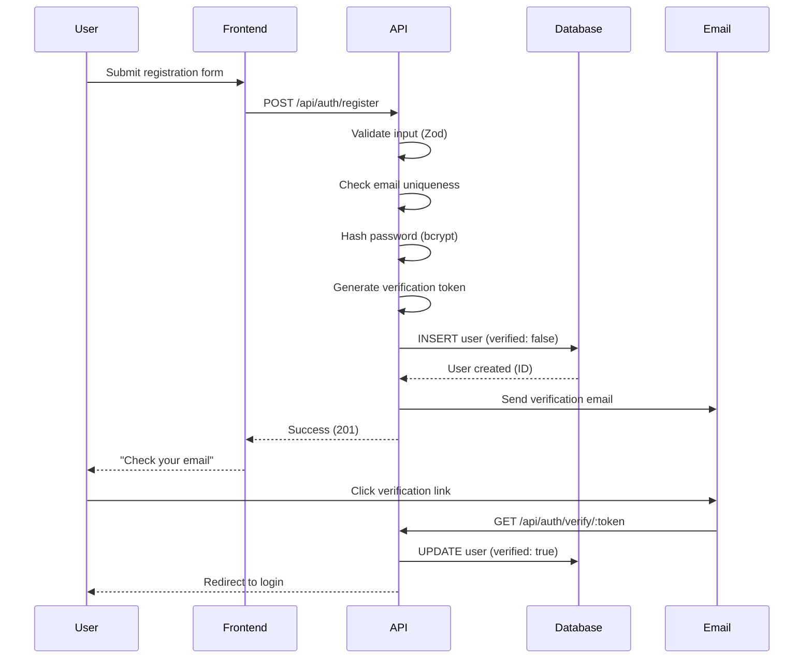
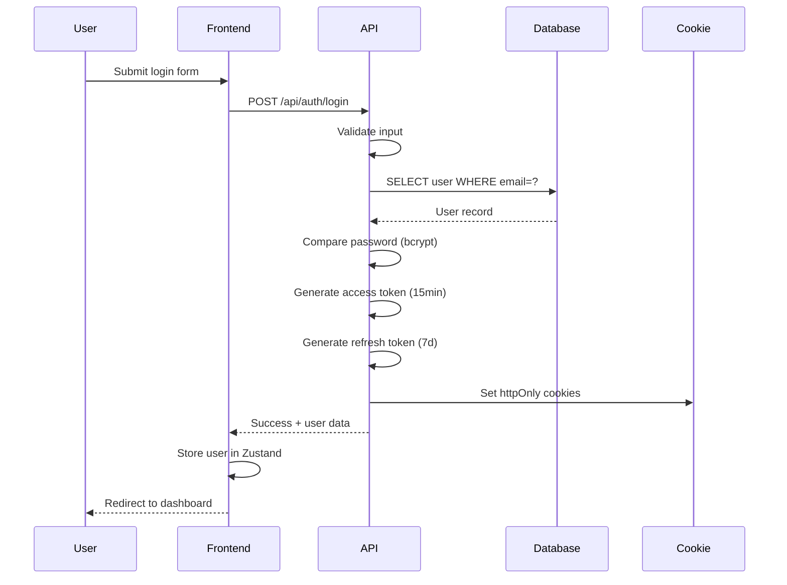
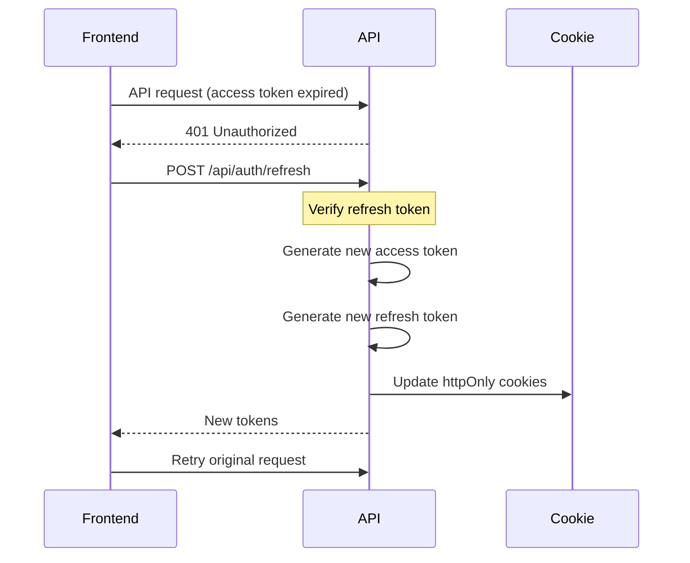

# Authentication System - Deep Dive

**Component**: Authentication & Authorization
**Complexity**: High
**Timeline**: Week 1-2 (Phase 1)
**Dependencies**: Prisma, JWT, bcrypt, Resend

---

## Table of Contents
1. [Architecture Overview](#architecture-overview)
2. [Authentication Flow](#authentication-flow)
3. [Security Considerations](#security-considerations)
4. [Implementation Guide](#implementation-guide)
5. [API Reference](#api-reference)
6. [Frontend Integration](#frontend-integration)
7. [Testing Strategy](#testing-strategy)
8. [Troubleshooting](#troubleshooting)

---

## Architecture Overview

### System Components

```
┌─────────────────────────────────────────────────────────────┐
│                      AUTHENTICATION SYSTEM                   │
└─────────────────────────────────────────────────────────────┘

┌──────────────┐    ┌──────────────┐    ┌──────────────┐
│   Frontend   │───▶│  API Gateway │───▶│   Database   │
│  (React App) │◀───│  (Fastify)   │◀───│ (PostgreSQL) │
└──────────────┘    └──────────────┘    └──────────────┘
       │                    │                     │
       │                    ▼                     │
       │            ┌──────────────┐             │
       │            │   JWT Token  │             │
       │            │   Middleware │             │
       │            └──────────────┘             │
       │                    │                     │
       ▼                    ▼                     ▼
┌──────────────┐    ┌──────────────┐    ┌──────────────┐
│   Zustand    │    │    bcrypt    │    │    Users     │
│ Auth Store   │    │  (hashing)   │    │    Table     │
└──────────────┘    └──────────────┘    └──────────────┘
                            │
                            ▼
                    ┌──────────────┐
                    │    Resend    │
                    │   (Email)    │
                    └──────────────┘
```

### Key Technologies

| Component | Technology | Purpose |
|-----------|-----------|---------|
| **Password Hashing** | bcrypt | Secure password storage (saltRounds: 12) |
| **Tokens** | JWT (jsonwebtoken) | Stateless authentication |
| **Token Storage** | httpOnly Cookies | XSS-safe token storage |
| **Email** | Resend | Email verification, password reset |
| **Rate Limiting** | @fastify/rate-limit | Brute-force protection |
| **Frontend State** | Zustand | Client-side auth state management |

---

## Authentication Flow

### 1. User Registration Flow



### 2. Login Flow



### 3. Token Refresh Flow



---

## Security Considerations

### Password Security

#### 1. Password Hashing (bcrypt)
```typescript
import bcrypt from 'bcrypt';

const SALT_ROUNDS = 12; // Recommended for 2025

// Hashing on registration
const passwordHash = await bcrypt.hash(password, SALT_ROUNDS);

// Verification on login
const isValid = await bcrypt.compare(password, user.passwordHash);
```

**Why bcrypt?**
- Adaptive: Can increase rounds as hardware improves
- Salt per password: Protects against rainbow table attacks
- Slow by design: Mitigates brute-force attacks

#### 2. Password Strength Requirements
```typescript
import zxcvbn from 'zxcvbn';

const validatePassword = (password: string) => {
  const result = zxcvbn(password);

  if (result.score < 3) {
    throw new Error(`Weak password: ${result.feedback.warning}`);
  }

  return true;
};
```

**Requirements:**
- Minimum length: 8 characters
- zxcvbn score ≥3 (out of 4)
- No common passwords (checked via zxcvbn)
- No user info in password (email, name)

### JWT Token Security

#### 1. Token Structure
```typescript
// Access Token (short-lived: 15 minutes)
{
  sub: userId,           // Subject (user ID)
  email: user.email,     // User email
  role: user.role,       // User role (admin, host, renter)
  iat: 1234567890,       // Issued at
  exp: 1234568790        // Expires at (15 min later)
}

// Refresh Token (long-lived: 7 days)
{
  sub: userId,
  type: 'refresh',
  iat: 1234567890,
  exp: 1235172690        // Expires at (7 days later)
}
```

#### 2. Token Storage: httpOnly Cookies
```typescript
reply.setCookie('accessToken', token, {
  httpOnly: true,      // Not accessible via JavaScript (XSS protection)
  secure: true,        // HTTPS only
  sameSite: 'strict',  // CSRF protection
  maxAge: 15 * 60,     // 15 minutes (in seconds)
  path: '/'
});
```

**Why httpOnly cookies?**
- ✅ XSS Protection: JavaScript cannot access tokens
- ✅ Automatic sending: No manual header management
- ✅ CSRF Protection: With sameSite=strict
- ❌ Downside: Requires CORS configuration

### Rate Limiting

#### 1. Login Endpoint Rate Limiting
```typescript
import rateLimit from '@fastify/rate-limit';

app.register(rateLimit, {
  max: 10,              // 10 requests
  timeWindow: '15 minutes',
  cache: 10000,
  redis: redisClient    // Use Redis for distributed rate limiting
});

app.post('/api/auth/login', {
  config: {
    rateLimit: {
      max: 5,           // Stricter limit for login
      timeWindow: '15 minutes'
    }
  }
}, loginHandler);
```

#### 2. Registration Endpoint Rate Limiting
```typescript
app.post('/api/auth/register', {
  config: {
    rateLimit: {
      max: 3,            // 3 registrations per hour
      timeWindow: '1 hour',
      keyGenerator: (req) => req.ip // Rate limit by IP
    }
  }
}, registerHandler);
```

### Additional Security Measures

#### 1. Email Verification
- Tokens expire after 24 hours
- One-time use only (deleted after verification)
- Cryptographically secure random tokens

#### 2. Audit Logging
```typescript
await prisma.auditLog.create({
  data: {
    userId: user.id,
    action: 'USER_LOGIN',
    ipAddress: req.ip,
    userAgent: req.headers['user-agent'],
    metadata: { success: true }
  }
});
```

#### 3. Failed Login Tracking
- Track failed attempts per user
- Lock account after 5 failed attempts (15 min cooldown)
- Email notification on account lock

---

## Implementation Guide

### Backend Implementation

#### Step 1: Set Up Dependencies
```bash
cd prepchef
npm install bcrypt jsonwebtoken zxcvbn resend @fastify/jwt @fastify/cookie @fastify/rate-limit
npm install -D @types/bcrypt @types/jsonwebtoken
```

#### Step 2: Environment Variables
```env
# .env
JWT_SECRET="your-super-secret-key-change-in-production"
JWT_REFRESH_SECRET="another-secret-for-refresh-tokens"
JWT_EXPIRES_IN="15m"
JWT_REFRESH_EXPIRES_IN="7d"

RESEND_API_KEY="re_..."
FROM_EMAIL="noreply@prepchef.com"

REDIS_URL="redis://localhost:6379"
```

#### Step 3: Create Password Utilities
```typescript
// prepchef/packages/common/src/lib/password.ts
import bcrypt from 'bcrypt';
import zxcvbn from 'zxcvbn';

const SALT_ROUNDS = 12;

export async function hashPassword(password: string): Promise<string> {
  // Validate strength first
  const strength = zxcvbn(password);
  if (strength.score < 3) {
    throw new Error(`Weak password: ${strength.feedback.warning || 'Please choose a stronger password'}`);
  }

  return bcrypt.hash(password, SALT_ROUNDS);
}

export async function verifyPassword(
  password: string,
  hash: string
): Promise<boolean> {
  return bcrypt.compare(password, hash);
}

export function generateVerificationToken(): string {
  return crypto.randomBytes(32).toString('hex');
}
```

#### Step 4: Create JWT Utilities
```typescript
// prepchef/packages/common/src/lib/jwt.ts
import jwt from 'jsonwebtoken';

const JWT_SECRET = process.env.JWT_SECRET!;
const JWT_REFRESH_SECRET = process.env.JWT_REFRESH_SECRET!;

export interface TokenPayload {
  sub: string;       // User ID
  email: string;
  role: 'admin' | 'host' | 'renter';
}

export function generateAccessToken(payload: TokenPayload): string {
  return jwt.sign(payload, JWT_SECRET, {
    expiresIn: '15m'
  });
}

export function generateRefreshToken(userId: string): string {
  return jwt.sign(
    { sub: userId, type: 'refresh' },
    JWT_REFRESH_SECRET,
    { expiresIn: '7d' }
  );
}

export function verifyAccessToken(token: string): TokenPayload {
  return jwt.verify(token, JWT_SECRET) as TokenPayload;
}

export function verifyRefreshToken(token: string): { sub: string } {
  const payload = jwt.verify(token, JWT_REFRESH_SECRET) as any;
  if (payload.type !== 'refresh') {
    throw new Error('Invalid token type');
  }
  return { sub: payload.sub };
}
```

#### Step 5: Create Registration Endpoint
```typescript
// prepchef/services/auth-svc/src/api/auth.ts
import { FastifyInstance, FastifyRequest, FastifyReply } from 'fastify';
import { z } from 'zod';
import { PrismaClient } from '@prisma/client';
import { hashPassword, generateVerificationToken } from '@prep/common';
import { Resend } from 'resend';

const prisma = new PrismaClient();
const resend = new Resend(process.env.RESEND_API_KEY);

const RegisterSchema = z.object({
  email: z.string().email(),
  password: z.string().min(8),
  fullName: z.string().min(2),
  role: z.enum(['host', 'renter']).default('renter')
});

export default async function (app: FastifyInstance) {
  app.post('/auth/register', async (req: FastifyRequest, reply: FastifyReply) => {
    // 1. Validate input
    const result = RegisterSchema.safeParse(req.body);
    if (!result.success) {
      return reply.code(400).send({
        error: 'Validation failed',
        details: result.error.errors
      });
    }

    const { email, password, fullName, role } = result.data;

    // 2. Check if user exists
    const existingUser = await prisma.user.findUnique({
      where: { email }
    });

    if (existingUser) {
      return reply.code(409).send({
        error: 'Email already registered'
      });
    }

    // 3. Hash password
    const passwordHash = await hashPassword(password);

    // 4. Generate verification token
    const verificationToken = generateVerificationToken();
    const verificationExpiresAt = new Date(Date.now() + 24 * 60 * 60 * 1000); // 24 hours

    // 5. Create user
    const user = await prisma.user.create({
      data: {
        email,
        username: email.split('@')[0], // Generate username from email
        passwordHash,
        fullName,
        role,
        verified: false,
        verificationToken,
        verificationExpiresAt
      }
    });

    // 6. Send verification email
    const verificationLink = `${process.env.FRONTEND_URL}/auth/verify/${verificationToken}`;

    await resend.emails.send({
      from: process.env.FROM_EMAIL!,
      to: email,
      subject: 'Verify your PrepChef account',
      html: `
        <h1>Welcome to PrepChef!</h1>
        <p>Please verify your email address by clicking the link below:</p>
        <a href="${verificationLink}">Verify Email</a>
        <p>This link will expire in 24 hours.</p>
      `
    });

    // 7. Audit log
    await prisma.auditLog.create({
      data: {
        userId: user.id,
        action: 'USER_REGISTERED',
        ipAddress: req.ip,
        userAgent: req.headers['user-agent'],
        metadata: { email, role }
      }
    });

    return reply.code(201).send({
      userId: user.id,
      message: 'Registration successful. Please check your email to verify your account.'
    });
  });
}
```

#### Step 6: Create Login Endpoint
```typescript
app.post('/auth/login', async (req: FastifyRequest, reply: FastifyReply) => {
  const LoginSchema = z.object({
    email: z.string().email(),
    password: z.string()
  });

  const result = LoginSchema.safeParse(req.body);
  if (!result.success) {
    return reply.code(400).send({ error: 'Invalid input' });
  }

  const { email, password } = result.data;

  // 1. Find user
  const user = await prisma.user.findUnique({
    where: { email },
    select: {
      id: true,
      email: true,
      passwordHash: true,
      role: true,
      verified: true,
      fullName: true
    }
  });

  if (!user) {
    // Generic error to prevent user enumeration
    return reply.code(401).send({ error: 'Invalid credentials' });
  }

  // 2. Check if verified
  if (!user.verified) {
    return reply.code(403).send({
      error: 'Email not verified',
      code: 'EMAIL_NOT_VERIFIED'
    });
  }

  // 3. Verify password
  const isValidPassword = await verifyPassword(password, user.passwordHash);
  if (!isValidPassword) {
    // Log failed attempt
    await prisma.auditLog.create({
      data: {
        userId: user.id,
        action: 'LOGIN_FAILED',
        ipAddress: req.ip,
        metadata: { reason: 'invalid_password' }
      }
    });

    return reply.code(401).send({ error: 'Invalid credentials' });
  }

  // 4. Generate tokens
  const accessToken = generateAccessToken({
    sub: user.id,
    email: user.email,
    role: user.role
  });

  const refreshToken = generateRefreshToken(user.id);

  // 5. Set cookies
  reply.setCookie('accessToken', accessToken, {
    httpOnly: true,
    secure: process.env.NODE_ENV === 'production',
    sameSite: 'strict',
    maxAge: 15 * 60, // 15 minutes
    path: '/'
  });

  reply.setCookie('refreshToken', refreshToken, {
    httpOnly: true,
    secure: process.env.NODE_ENV === 'production',
    sameSite: 'strict',
    maxAge: 7 * 24 * 60 * 60, // 7 days
    path: '/'
  });

  // 6. Update last login
  await prisma.user.update({
    where: { id: user.id },
    data: { lastLoginAt: new Date() }
  });

  // 7. Audit log
  await prisma.auditLog.create({
    data: {
      userId: user.id,
      action: 'USER_LOGIN',
      ipAddress: req.ip,
      userAgent: req.headers['user-agent'],
      metadata: { success: true }
    }
  });

  // 8. Return user data (without sensitive fields)
  return reply.send({
    user: {
      id: user.id,
      email: user.email,
      fullName: user.fullName,
      role: user.role
    },
    message: 'Login successful'
  });
});
```

#### Step 7: Create Auth Middleware
```typescript
// prepchef/packages/common/src/middleware/requireAuth.ts
import { FastifyRequest, FastifyReply } from 'fastify';
import { verifyAccessToken, TokenPayload } from '../lib/jwt';

declare module 'fastify' {
  interface FastifyRequest {
    user?: TokenPayload;
  }
}

export async function requireAuth(
  req: FastifyRequest,
  reply: FastifyReply
) {
  const accessToken = req.cookies.accessToken;

  if (!accessToken) {
    return reply.code(401).send({
      error: 'Authentication required',
      code: 'NO_TOKEN'
    });
  }

  try {
    const payload = verifyAccessToken(accessToken);
    req.user = payload;
  } catch (error) {
    if (error.name === 'TokenExpiredError') {
      return reply.code(401).send({
        error: 'Token expired',
        code: 'TOKEN_EXPIRED'
      });
    }

    return reply.code(401).send({
      error: 'Invalid token',
      code: 'INVALID_TOKEN'
    });
  }
}

export function requireRole(allowedRoles: string[]) {
  return async (req: FastifyRequest, reply: FastifyReply) => {
    if (!req.user) {
      return reply.code(401).send({ error: 'Authentication required' });
    }

    if (!allowedRoles.includes(req.user.role)) {
      return reply.code(403).send({
        error: 'Insufficient permissions',
        required: allowedRoles,
        current: req.user.role
      });
    }
  };
}
```

### Frontend Implementation

#### Step 1: Create Auth Store (Zustand)
```typescript
// apps/web/src/stores/authStore.ts
import { create } from 'zustand';
import { persist } from 'zustand/middleware';

interface User {
  id: string;
  email: string;
  fullName: string;
  role: 'admin' | 'host' | 'renter';
}

interface AuthStore {
  user: User | null;
  isAuthenticated: boolean;
  login: (email: string, password: string) => Promise<void>;
  register: (email: string, password: string, fullName: string, role: 'host' | 'renter') => Promise<void>;
  logout: () => Promise<void>;
  refreshToken: () => Promise<boolean>;
}

export const useAuthStore = create<AuthStore>()(
  persist(
    (set, get) => ({
      user: null,
      isAuthenticated: false,

      login: async (email, password) => {
        const response = await fetch('/api/auth/login', {
          method: 'POST',
          headers: { 'Content-Type': 'application/json' },
          body: JSON.stringify({ email, password }),
          credentials: 'include' // Important: send cookies
        });

        if (!response.ok) {
          const error = await response.json();
          throw new Error(error.error || 'Login failed');
        }

        const { user } = await response.json();
        set({ user, isAuthenticated: true });
      },

      register: async (email, password, fullName, role) => {
        const response = await fetch('/api/auth/register', {
          method: 'POST',
          headers: { 'Content-Type': 'application/json' },
          body: JSON.stringify({ email, password, fullName, role }),
          credentials: 'include'
        });

        if (!response.ok) {
          const error = await response.json();
          throw new Error(error.error || 'Registration failed');
        }
      },

      logout: async () => {
        await fetch('/api/auth/logout', {
          method: 'POST',
          credentials: 'include'
        });

        set({ user: null, isAuthenticated: false });
      },

      refreshToken: async () => {
        try {
          const response = await fetch('/api/auth/refresh', {
            method: 'POST',
            credentials: 'include'
          });

          if (response.ok) {
            const { user } = await response.json();
            set({ user, isAuthenticated: true });
            return true;
          }

          set({ user: null, isAuthenticated: false });
          return false;
        } catch {
          set({ user: null, isAuthenticated: false });
          return false;
        }
      }
    }),
    {
      name: 'auth-storage',
      partialize: (state) => ({ user: state.user }) // Only persist user data
    }
  )
);
```

#### Step 2: Create Protected Route Component
```typescript
// apps/web/src/components/ProtectedRoute.tsx
import { Navigate } from 'react-router-dom';
import { useAuthStore } from '../stores/authStore';

interface ProtectedRouteProps {
  children: React.ReactNode;
  requiredRole?: 'admin' | 'host' | 'renter';
}

export function ProtectedRoute({ children, requiredRole }: ProtectedRouteProps) {
  const { isAuthenticated, user } = useAuthStore();

  if (!isAuthenticated) {
    return <Navigate to="/login" replace />;
  }

  if (requiredRole && user?.role !== requiredRole) {
    return <Navigate to="/unauthorized" replace />;
  }

  return <>{children}</>;
}
```

#### Step 3: Create Login Form
```typescript
// apps/web/src/components/auth/LoginForm.tsx
import { useForm } from 'react-hook-form';
import { zodResolver } from '@hookform/resolvers/zod';
import { z } from 'zod';
import { useAuthStore } from '../../stores/authStore';
import { useNavigate } from 'react-router-dom';

const LoginSchema = z.object({
  email: z.string().email('Invalid email address'),
  password: z.string().min(1, 'Password is required')
});

type LoginFormData = z.infer<typeof LoginSchema>;

export function LoginForm() {
  const navigate = useNavigate();
  const login = useAuthStore((state) => state.login);

  const {
    register,
    handleSubmit,
    formState: { errors, isSubmitting },
    setError
  } = useForm<LoginFormData>({
    resolver: zodResolver(LoginSchema)
  });

  const onSubmit = async (data: LoginFormData) => {
    try {
      await login(data.email, data.password);
      navigate('/dashboard');
    } catch (error: any) {
      setError('root', {
        message: error.message || 'Login failed'
      });
    }
  };

  return (
    <form onSubmit={handleSubmit(onSubmit)} className="space-y-4">
      <div>
        <label htmlFor="email" className="block text-sm font-medium">
          Email
        </label>
        <input
          id="email"
          type="email"
          {...register('email')}
          className="mt-1 block w-full rounded-md border-gray-300"
          aria-invalid={errors.email ? 'true' : 'false'}
        />
        {errors.email && (
          <p className="mt-1 text-sm text-red-600" role="alert">
            {errors.email.message}
          </p>
        )}
      </div>

      <div>
        <label htmlFor="password" className="block text-sm font-medium">
          Password
        </label>
        <input
          id="password"
          type="password"
          {...register('password')}
          className="mt-1 block w-full rounded-md border-gray-300"
          aria-invalid={errors.password ? 'true' : 'false'}
        />
        {errors.password && (
          <p className="mt-1 text-sm text-red-600" role="alert">
            {errors.password.message}
          </p>
        )}
      </div>

      {errors.root && (
        <div className="rounded-md bg-red-50 p-4">
          <p className="text-sm text-red-800">{errors.root.message}</p>
        </div>
      )}

      <button
        type="submit"
        disabled={isSubmitting}
        className="w-full rounded-md bg-blue-600 px-4 py-2 text-white hover:bg-blue-700 disabled:opacity-50"
      >
        {isSubmitting ? 'Logging in...' : 'Log In'}
      </button>
    </form>
  );
}
```

---

## API Reference

### POST /api/auth/register
Register a new user account.

**Request Body:**
```json
{
  "email": "john@example.com",
  "password": "SecurePass123!",
  "fullName": "John Doe",
  "role": "host" | "renter"
}
```

**Response (201):**
```json
{
  "userId": "uuid",
  "message": "Registration successful. Please check your email."
}
```

**Errors:**
- `400`: Validation error
- `409`: Email already registered
- `429`: Too many registration attempts

---

### POST /api/auth/login
Authenticate user and receive tokens.

**Request Body:**
```json
{
  "email": "john@example.com",
  "password": "SecurePass123!"
}
```

**Response (200):**
```json
{
  "user": {
    "id": "uuid",
    "email": "john@example.com",
    "fullName": "John Doe",
    "role": "host"
  },
  "message": "Login successful"
}
```

**Cookies Set:**
- `accessToken` (httpOnly, 15min)
- `refreshToken` (httpOnly, 7d)

**Errors:**
- `401`: Invalid credentials
- `403`: Email not verified
- `429`: Too many login attempts

---

### POST /api/auth/refresh
Refresh expired access token.

**Request:** (refreshToken cookie required)

**Response (200):**
```json
{
  "user": { ... }
}
```

**Cookies Updated:**
- `accessToken` (new token)
- `refreshToken` (new token)

**Errors:**
- `401`: Invalid or expired refresh token

---

### GET /api/auth/verify/:token
Verify email address.

**Response (200):**
```json
{
  "message": "Email verified successfully"
}
```

**Errors:**
- `400`: Invalid or expired token
- `404`: User not found

---

### POST /api/auth/logout
Log out user (clear cookies).

**Response (200):**
```json
{
  "message": "Logged out successfully"
}
```

---

## Testing Strategy

### Unit Tests

```typescript
// prepchef/services/auth-svc/src/__tests__/password.test.ts
import { hashPassword, verifyPassword } from '@prep/common';

describe('Password Utilities', () => {
  describe('hashPassword', () => {
    it('should hash a strong password', async () => {
      const password = 'StrongPassword123!';
      const hash = await hashPassword(password);

      expect(hash).not.toBe(password);
      expect(hash).toMatch(/^\$2[aby]\$\d+\$/); // bcrypt format
    });

    it('should reject weak passwords', async () => {
      const weakPassword = '12345678';

      await expect(hashPassword(weakPassword)).rejects.toThrow('Weak password');
    });
  });

  describe('verifyPassword', () => {
    it('should verify correct password', async () => {
      const password = 'StrongPassword123!';
      const hash = await hashPassword(password);

      const isValid = await verifyPassword(password, hash);
      expect(isValid).toBe(true);
    });

    it('should reject incorrect password', async () => {
      const password = 'StrongPassword123!';
      const hash = await hashPassword(password);

      const isValid = await verifyPassword('WrongPassword', hash);
      expect(isValid).toBe(false);
    });
  });
});
```

### Integration Tests

```typescript
// prepchef/services/auth-svc/src/__tests__/auth.integration.test.ts
import { createApp } from '../index';
import { PrismaClient } from '@prisma/client';

const prisma = new PrismaClient();

describe('Auth API', () => {
  let app;

  beforeAll(async () => {
    app = await createApp();
    await app.ready();
  });

  afterAll(async () => {
    await app.close();
    await prisma.$disconnect();
  });

  describe('POST /auth/register', () => {
    it('should register a new user', async () => {
      const response = await app.inject({
        method: 'POST',
        url: '/auth/register',
        payload: {
          email: 'test@example.com',
          password: 'StrongPassword123!',
          fullName: 'Test User',
          role: 'renter'
        }
      });

      expect(response.statusCode).toBe(201);
      expect(response.json()).toMatchObject({
        userId: expect.any(String),
        message: expect.stringContaining('email')
      });
    });

    it('should reject duplicate email', async () => {
      // Register first user
      await app.inject({
        method: 'POST',
        url: '/auth/register',
        payload: {
          email: 'duplicate@example.com',
          password: 'StrongPassword123!',
          fullName: 'First User',
          role: 'renter'
        }
      });

      // Try to register again
      const response = await app.inject({
        method: 'POST',
        url: '/auth/register',
        payload: {
          email: 'duplicate@example.com',
          password: 'DifferentPassword123!',
          fullName: 'Second User',
          role: 'host'
        }
      });

      expect(response.statusCode).toBe(409);
      expect(response.json().error).toContain('already registered');
    });
  });

  describe('POST /auth/login', () => {
    beforeAll(async () => {
      // Create verified user for login tests
      const user = await prisma.user.create({
        data: {
          email: 'login-test@example.com',
          username: 'logintest',
          passwordHash: await hashPassword('TestPassword123!'),
          fullName: 'Login Test',
          role: 'renter',
          verified: true
        }
      });
    });

    it('should login with valid credentials', async () => {
      const response = await app.inject({
        method: 'POST',
        url: '/auth/login',
        payload: {
          email: 'login-test@example.com',
          password: 'TestPassword123!'
        }
      });

      expect(response.statusCode).toBe(200);
      expect(response.json()).toMatchObject({
        user: {
          email: 'login-test@example.com',
          fullName: 'Login Test',
          role: 'renter'
        }
      });

      // Check cookies
      const cookies = response.cookies;
      expect(cookies.find(c => c.name === 'accessToken')).toBeDefined();
      expect(cookies.find(c => c.name === 'refreshToken')).toBeDefined();
    });

    it('should reject invalid password', async () => {
      const response = await app.inject({
        method: 'POST',
        url: '/auth/login',
        payload: {
          email: 'login-test@example.com',
          password: 'WrongPassword123!'
        }
      });

      expect(response.statusCode).toBe(401);
      expect(response.json().error).toContain('Invalid credentials');
    });
  });
});
```

---

## Troubleshooting

### Common Issues

#### 1. "Token expired" error on every request
**Cause**: Access token TTL too short or clock skew between client/server

**Solution:**
```typescript
// Add clock tolerance to JWT verification
jwt.verify(token, secret, {
  clockTolerance: 60 // Allow 60 seconds clock skew
});
```

#### 2. Cookies not being sent from frontend
**Cause**: CORS misconfiguration or missing `credentials: 'include'`

**Solution:**
```typescript
// Backend (Fastify CORS)
app.register(cors, {
  origin: process.env.FRONTEND_URL,
  credentials: true // Important!
});

// Frontend (fetch)
fetch('/api/auth/login', {
  credentials: 'include' // Important!
});
```

#### 3. "bcrypt compare takes too long"
**Cause**: Salt rounds too high for your hardware

**Solution:**
```typescript
// Reduce salt rounds temporarily (not recommended for production)
const SALT_ROUNDS = 10; // Default is 12

// Or: Offload hashing to background job
const job = await queue.add('hash-password', { password });
```

#### 4. Email verification link not working
**Cause**: Token expired or already used

**Solution:**
```typescript
// Add "resend verification" endpoint
app.post('/auth/resend-verification', async (req, reply) => {
  const { email } = req.body;

  const user = await prisma.user.findUnique({
    where: { email }
  });

  if (!user || user.verified) {
    return reply.code(400).send({ error: 'Invalid request' });
  }

  // Generate new token
  const newToken = generateVerificationToken();
  await prisma.user.update({
    where: { id: user.id },
    data: {
      verificationToken: newToken,
      verificationExpiresAt: new Date(Date.now() + 24 * 60 * 60 * 1000)
    }
  });

  // Send email
  await sendVerificationEmail(email, newToken);

  return reply.send({ message: 'Verification email resent' });
});
```

---

## Next Steps

After implementing authentication:
1. ✅ Add integration tests (target: 80% coverage)
2. ✅ Set up Sentry error tracking
3. ✅ Configure rate limiting
4. ➡️ Proceed to [Booking Deep Dive](./BOOKING_DEEP_DIVE.md)
5. ➡️ Proceed to [Payments Deep Dive](./PAYMENTS_DEEP_DIVE.md)

---

## Resources

- [OWASP Authentication Cheat Sheet](https://cheatsheetseries.owasp.org/cheatsheets/Authentication_Cheat_Sheet.html)
- [JWT Best Practices](https://tools.ietf.org/html/rfc8725)
- [bcrypt npm package](https://www.npmjs.com/package/bcrypt)
- [Fastify JWT plugin](https://github.com/fastify/fastify-jwt)
